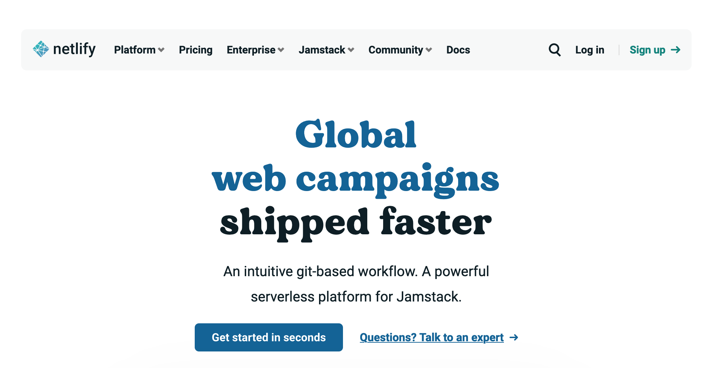
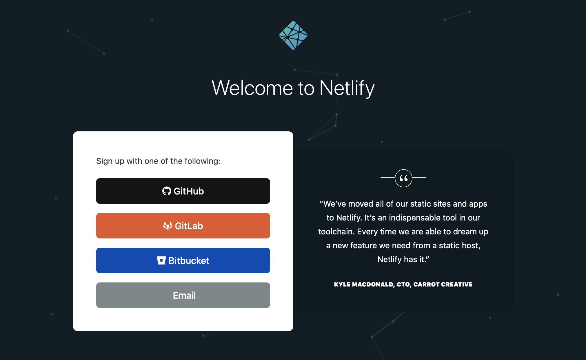

Welcome to the [Introducing Yourself Online](/) workshop! Before attending the workshop on February 25th, please complete the following prework.

## Set up RStudio Cloud

Sign up for a free RStudio Cloud account at https://rstudio.cloud/ before the workshop. I recommend logging in with an existing Google or GitHub account, if you have one (rather than creating a new account with another password you have to remember). I want you to be able to work from your own laptop in this workshop, but Cloud is an important back-up plan should you run into troubles.

## Set up GitHub

We will be using GitHub in this workshop for version control and publishing. Sign up for a free GitHub.com account at <https://github.com/join> if you don't already have one. Also:

+ Complete these [installation instructions](https://happygitwithr.com/install-intro.html).
    
+ Test your connection between GitHub and RStudio following [these steps](https://happygitwithr.com/connect-intro.html).

+ **NOTE:** We *strongly recommend* that:
    + you choose [HTTPS over SSH](https://happygitwithr.com/https-pat.html#https-vs-ssh), and
    + you setup a [GitHub Personal Access Token](https://cfss.uchicago.edu/setup/git-configure/#cache-credentials-for-https).

## Sign up for Netlify

Netlify is a platform that offers cloud hosting and serverless backend services for static websites. Lucky for us, that is what we need -- we'll be making static websites together! Netlify has a free plan, which we will use in this workshop. Please go ahead and sign up:

1. Go online to [Netlify.com](https://www.netlify.com/).

1. Click on the "Sign Up" button. 

    

1. I recommend signing up using your existing GitHub account (no need to create another account), so select "GitHub" (you may need to sign in), and click to "Authorize Netlify."

    


## Installations

On the days of the workshop, please plan to work from a laptop that has the following installed:

+ A recent version of R (>=4.1.0), which is available for free at https://cloud.r-project.org/
    
+ The most recent version of the RStudio Desktop Integrated Development Environment (IDE version 1.4), available for free ([RStudio Desktop Open Source License](https://www.rstudio.com/products/rstudio/download/#download)). Read up on the latest version [here](https://blog.rstudio.com/2021/01/19/announcing-rstudio-1-4/).
    
+ The R packages we will use, which you can install by connecting to the internet, opening RStudio, and running at the command line:

    ```r
    > install.packages(c("usethis", "remotes", "rmarkdown",
                         "postcards", "blogdown"))
    ```
    

+ Restart your R session before using any newly installed packages :smile:

## Install Hugo

We will use the `blogdown` package to make a Hugo website. Please go ahead and install Hugo:
 
```r
blogdown::install_hugo()
```

And ensure your current version is at least as high as:

```r
> blogdown::hugo_version()
[1] ‘0.92.2’
```

## Markdown review

Please complete this [10-minute interactive tutorial on Markdown](https://commonmark.org/help/tutorial/) if you are not already familiar with the fundamentals of Markdown.

## Check pandoc

The RStudio IDE bundles an updated version of pandoc- if you did install v1.4 of the IDE, you should be all set with version `2.11.2`. If not, go back to finish up the [installations](#installations) steps.

```r
rmarkdown::pandoc_version()
[1] ‘2.14.2’
```
