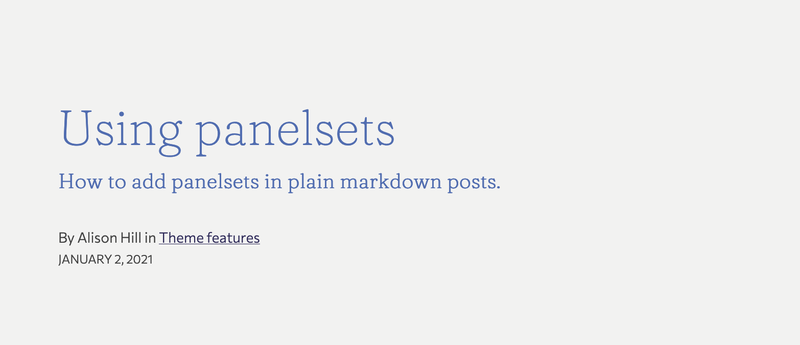
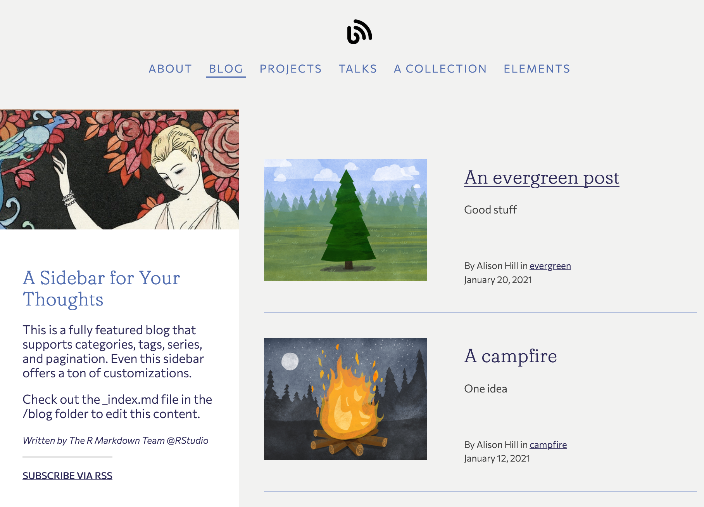

```{r setup, include=FALSE}
options(htmltools.dir.version = FALSE)
knitr::opts_chunk$set(
  echo = FALSE,
  cache = TRUE,
  message = FALSE,
  warning = FALSE,
  collapse = TRUE,
  fig.retina = 2, fig.width = 12
)

library(tidyverse)
library(here)
library(knitr)
library(countdown)
library(flipbookr)
library(xaringanExtra)
library(magick)

set.seed(123)
theme_set(theme_minimal(base_size = rcfss::base_size))
```

```{r share-again, echo=FALSE}
xaringanExtra::use_share_again()
```

background-image: url(img/internet.jpg)
background-position: 50% 20%
background-size: 50%
background-color: #ffffff

# Why introduce yourself online? 

---

# Why introduce yourself online? 

--

Fame? 

--

Fortune? 

--

Friendship? 

--

Findability? 

--

Fun?

--

Functional?

---

# Why introduce yourself online? 

~~Fame~~ `r emo::ji("x")`

~~Fortune~~ `r emo::ji("x")`

Friendship `r emo::ji("heavy_check_mark")`

Findability `r emo::ji("heavy_check_mark")`

Fun `r emo::ji("heavy_check_mark")`

Functional `r emo::ji("heavy_check_mark")`

---

# How to introduce yourself online?

Lots of ways!

Today:

--

1. GitHub profile `r emo::ji("name_badge")`

1. A postcard (about page) `r emo::ji("love_letter")`

1. A blogdown site `r emo::ji("dango")`

---

# "Must I blog?"

No. 

--

But you can. And if you do, you may follow your own rules. It is *your* space.


---

class: activity

# `r emo::ji("stopwatch")` To GitHub.com!

Let's make our GitHub name tags right now

```{r cache = FALSE}
countdown(minutes = 10)
```

---

background-image: url(img/index.jpg)
background-position: 50% 20%
background-size: 50%
background-color: #ffffff

# Why R Markdown?

---

# Why R Markdown?

--

Use R code inside

--

Use RStudio IDE

--

Use the tools you already use (or should be using- `r emo::ji("wink")`) for your work

---

class: inverse, center, middle

## What *is* R Markdown?

---

# What is R Markdown?


1. An authoring framework for data science.

1. A document format (`.Rmd`).

1. An R package named `rmarkdown`.

1. A file format for making dynamic documents with R. 

1. A tool for integrating prose, code, and results.

1. A computational document.

1. Wizardry.


---

# What is R Markdown?

1. ["An authoring framework for data science."](https://rmarkdown.rstudio.com/lesson-1.html) (`r emo::ji("heavy_check_mark")`)

1. [A document format (`.Rmd`).](https://bookdown.org/yihui/rmarkdown/) (`r emo::ji("heavy_check_mark")`)

1. [An R package named `rmarkdown`.](https://rmarkdown.rstudio.com/docs/) (`r emo::ji("heavy_check_mark")`)

1. ["A file format for making dynamic documents with R."](https://rmarkdown.rstudio.com/articles_intro.html) (`r emo::ji("heavy_check_mark")`)

1. ["A tool for integrating text, code, and results."](https://r4ds.had.co.nz/communicate-intro.html) (`r emo::ji("heavy_check_mark")`)

1. ["A computational document."](http://radar.oreilly.com/2011/07/wolframs-computational-documen.html) (`r emo::ji("heavy_check_mark")`)

1. Wizardry. (`r emo::ji("wizard")`)

---
background-image: url("img/rmd_flowchart.png")
background-size: contain
background-color: #f6f6f6

# What is R Markdown?

---
background-image: url(img/rmarkdown_hedgehog_wide.png)
background-size: contain
background-position: middle, center

---
background-image: url(img/rmd-buddy.jpg)
background-size: contain
background-size: 50%
background-color: #ffffff

---
background-image: url(img/rmd-buddy-help.jpg)
background-size: contain
background-size: 50%
background-color: #ffffff

---
background-image: url(img/short1.jpg)
background-size: contain
background-color: #ffffff

---
background-image: url(img/short2.jpg)
background-size: contain
background-color: #ffffff

---
background-image: url(img/short3.jpg)
background-size: contain
background-color: #ffffff

---
class: inverse, center, middle

## Start with GitHub Pages `r emo::ji("rocket")`

---

.pull-left[
## Repo

`https://github.com/bensoltoff/iyo-postcard/`

]

.pull-right[
## Link

`https://bensoltoff.github.io/iyo-postcard/`

]

---

.pull-left[
## Repo

`https://github.com/<user>/<repo>`

]

.pull-right[
## Link

`https://<user>.github.io/<repo>`

]

---
background-image: url(img/index.jpg)
background-size: contain
background-size: 50%
background-color: #ffffff


---
class: middle, center

.left-column[
## Index file link


## Other file link

]

.right-column[

<br>
`https://<user>.github.io/<repo>`
<br><br><br>
`https://<user>.github.com/<repo>/<.html>`

]

---

class: activity

# `r emo::ji("stopwatch")` To RStudio!

Let's make a homepage with the `postcards` package.

```{r cache = FALSE}
countdown(minutes = 10)
```

---

background-image: url(img/server.jpg)
background-position: 50% 20%
background-size: 50%
background-color: #ffffff

# Why Netlify?

---
class: inverse, center, middle

## Mood

---
background-image: url(img/mr-rogers.jpg)
background-size: 80%
class: bottom, center


<!--https://twitter.com/jlengstorf/status/1334594454347415554?s=20-->

---
background-image: url("img/server.jpg")
background-size: 80%
background-position: bottom
class: center, top
background-color: #ffffff

# What is next?

--


---
class: inverse, center, middle

## Why Netlify?

---

# Why Netlify?

--

Continuous deployment

--

Speaks Hugo (but not R)

--

FEATURES (PR deploy previews / branch deploys / rollbacks)

---
class: inverse, middle

> Continuous deployment works by connecting a Git repository to a Netlify site and keeping the two in sync.

> &mdash; [Netlify docs](https://docs.netlify.com/site-deploys/create-deploys/)

---
class: inverse, middle

## `r emo::ji("megaphone")` Speaks Hugo

---
class: middle, center

```{r echo = FALSE, out.width="80%"}
list_png <- c("img/blogdown-build/Slide1.png",
              "img/blogdown-build/Slide2.png",
              "img/blogdown-build/Slide3.png")

list_png %>% 
  map(image_read) %>% # reads each path file
  image_join() %>% # joins image
  image_scale("2000") %>% 
  image_animate(fps = .5)  # animates, can opt for number of loops
```

---
class: middle, center
```{r echo = FALSE, out.width = "80%"}
list_png <- c("img/blogdown-build/Slide3.png",
              "img/blogdown-build/Slide4.png",
              "img/blogdown-build/Slide5.png")

list_png %>% 
  map(image_read) %>% # reads each path file
  image_join() %>% # joins image
  image_scale("2000") %>% 
  image_animate(fps = .5)  # animates, can opt for number of loops
```

---
class: middle, center

```{r echo = FALSE, out.width = "80%"}
list_png <- c("img/blogdown-build/Slide6.png",
              "img/blogdown-build/Slide7.png",
              "img/blogdown-build/Slide8.png")

list_png %>% 
  map(image_read) %>% # reads each path file
  image_join() %>% # joins image
  image_scale("2000") %>% 
  image_animate(fps = .5)  # animates, can opt for number of loops
```


---
class: inverse, center, middle

## Whither GitHub Pages?

--

If you `build_site()`, you can commit + push your `public/` folder to use GitHub Pages.

---
class: inverse, center, middle

## Why Netlify?

Go to this repo:
<https://github.com/hugo-apero/iyo-apero>

Click on the "Deploy to Netlify" button `r emo::ji("rocket")`

---
class: activity

# `r emo::ji("stopwatch")`  To your new site!

Let's go on a file scavenger hunt.

```{r cache = FALSE}
countdown(minutes = 10)
```

---

background-image: url(img/gopher-hero.svg)
background-position: 50% 20%
background-size: 25%
background-color: #ffffff

# Why Hugo?

---

# Why Hugo?

--

Markdown first

--

Content organization (subfolders!)

--

Layouts

--

Multilingual sites

--

Powerful taxonomies

--

Magical [list templates](https://gohugo.io/templates/lists/)

---
class: inverse, center, middle

## What *is* Hugo?

--

`themes/hugo-apero/layouts/`

---

```html
<header class="post-header">
  <h1 class="f1 lh-solid measure-narrow mb3 fw4">{{ .Title }}</h1>
  {{ if .Params.subtitle }}
    <h4 class="f4 mt0 mb4 lh-title measure">
    {{ .Params.subtitle }}
    </h4>
  {{ end }}
</header>
```

--




---
class: bottom, center
background-image: url(img/mustache.jpg)
background-size: 25%
background-color: #ffffff


## Hugo = a double curly brace templating system

## `{{ <hugo code goes here> }}`


---

# Use your YAMLs `r emo::ji("sweet_potato")`

AKA "frontmatter"

.pull-left[
```yaml
---
title: "Using panelsets"
subtitle: "How to add panelsets..."
---
```
]

--

.pull-right[
```go

{{ .Title }}
{{ .Params.subtitle }}

```
]


---

# Hugo Page Bundles

```
.
├── content/
│   ├── privacy/index.md       # => a leaf bundle
│   └── faves/                 # => a branch bundle
│       ├── _index.md          # => AHA!
│       ├── roses/index.md     # => a leaf bundle
│       ├── kittens/index.md   # => another leaf bundle
│       └── kettles/index.md   # => yet another leaf bundle
```

---

# Hugo list vs single templates

.pull-left[

]

--

.pull-right[

]

---

# Hugo list vs single templates

```
.
├── content/
│   ├── privacy/index.md       # => single page
│   └── faves/                 
│       ├── _index.md          # => **list all faves**!
│       ├── roses/index.md     # => single page
│       ├── kittens/index.md   # => single page
│       └── kettles/index.md   # => single page
```

---

class: activity

# `r emo::ji("stopwatch")` To configure your new Hugo site!

```{r cache = FALSE}
countdown(minutes = 10)
```

---

background-image: url(img/stars.jpg)
background-position: 50% 20%
background-size: 30%
background-color: #ffffff

# Why Hugo Apéro?

---

# Hugo themes

- [Hugo themes](https://themes.gohugo.io/)


--

- [Computing for the Social Sciences](https://cfss.uchicago.edu/)
- <https://www.drcathicks.com/>
- <https://amber.rbind.io/>
- <https://third-bit.com/>
- <https://malco.io/>
- <https://isabella-b.com/>
- <https://www.allisonhorst.com/>
- <https://juliasilge.com/>
- <https://www.silviacanelon.com/>


---
class: activity

# `r emo::ji("stopwatch")` To your site!

Make it yours: customize the home + about pages

```{r cache = FALSE}
countdown(minutes = 10)
```

---

background-image: url(img/goodnight-site.jpg)
background-position: 50% 20%
background-size: 50%
background-color: #ffffff

# Why blogdown?

---

# Why blogdown?

--

R!

--

Checking functions `r emo::ji("heavy_check_mark")`

```r
check_config()
check_gitignore()
check_hugo()
check_content()
check_netlify()
check_site()
```

--

Hugo versioning system

--

`.Rprofile` for custom experience 

---
class: activity

# `r emo::ji("stopwatch")` To your site!

Run checks, or add/edit content.

```{r cache = FALSE}
countdown(minutes = 10)
```

